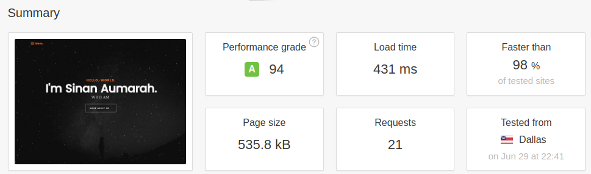

# [SinanAumarah.com](https://sinanaumarah.com)

# Prerequisites
- Ruby: v3.3+
- Jekyll: v3.9+

## How to assemble and run ?
run `jekyll serve --watch` or `bundle exec jekyll serve --watch`

For WSL:
`bundle exec jekyll serve --force_polling`

## Performance grade by Pingdom;

## Plugins + references:

Fonts:
 - Lora Font (https://www.google.com/fonts/specimen/Lora)
 - Poppins Font (https://www.google.com/fonts/specimen/Poppins)

Icons:
 - Font Awesome (http://fortawesome.github.io/Font-Awesome/)
 - Micons (http://geticonjar.com/freebies/231-micons/)
 - Micons webfont generated by ICOMOON (https://icomoon.io/)

Images:
 - UnSplash.com (http://unsplash.com/)
 - gratisography.com (http://www.gratisography.com/)

Javascript Files:

 - JQuery (http://jquery.com/)
 - jQuery Placeholder (https://github.com/mathiasbynens/jquery-placeholder)
 - pace js (http://github.hubspot.com/pace/)

